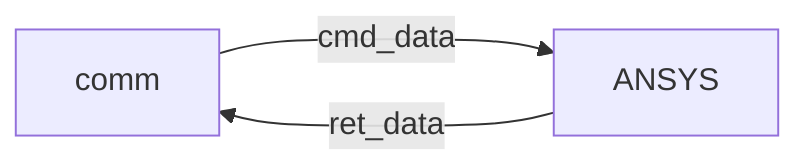

# 开发文档
## 通讯协议
通过 socket 进行通讯，格式为 JSON。具体流程如下：

```mermaid
graph LR
    A[comm]--->|cmd_data|B[ANSYS]
    B-->|ret_data|A
```

### `cmd_data`:
- `'cmd'`: 命令类型
  - 若为 `exit`，则退出程序
  - 若为 `solve`，则根据设置的预紧力进行求解
- `'pretensions'`：各个螺栓的预紧力，对应的值为一个数组